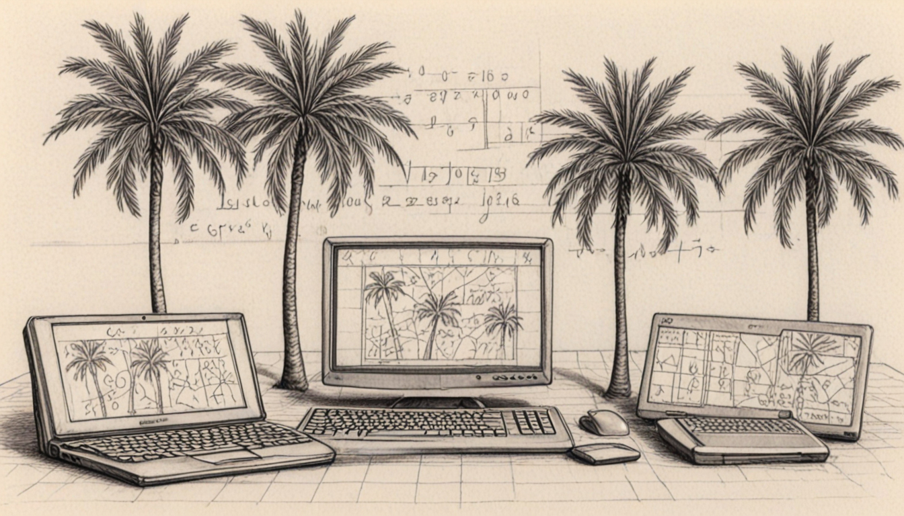

# Charleston Lean Meetup

## Contact

Join us on [Charleston Tech Slack](https://charlestontechslack.slack.com/)
in the #proof-assistants channel.
* @benraz
* @calstad
* @jared.corduan

Email [Jared](https://jaredcorduan.github.io) for an invitation.

## Meetings

We meet on the **second Tuesday** of every month at [Charleston Digital](https://www.charlestondigital.com).

* October 14, 2025 - :sparkles:
* Sept 9, 2025 - [Goedel-Prover](https://arxiv.org/abs/2502.07640)
* May 13, 2025 - Lean & AI
* April 8, 2025 - Proving language semantics
* March 11, 2025 - Proving math theorems together (hackathon style)
* February 11, 2025 - AI models in Lean development
* January 14, 2025 - Monads
* December 10, 2024 - Advent of code
* November 12, 2024 - Programming in Lean basics / Perceus: Garbage Free Reference Counting with Reuse
* October 8, 2024 - Quantifiers / Proving Lean Theorems in Zero-Knowledge
* September 10, 2024 - Tactics
* August 13, 2024 - Fixed-length vectors
* July 9, 2024 - Natural Numbers
* June 11, 2024  - Introduction
